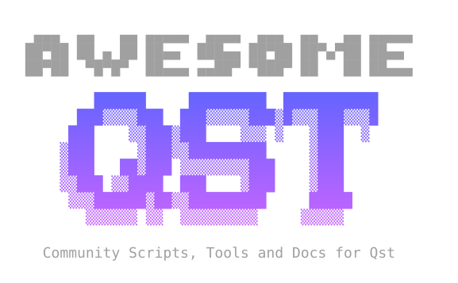

<p align="center">
  
</p>


This repository hosts the curated plugin catalog for [qst](https://github.com/gitanelyon/qst), a terminal-first Linux application launcher built with Rust and Ratatui.

## What is here

- `scripts/`: plugin scripts used by qst, including shell, Python, Perl, and other supported script types.
- `API.md`: protocol reference for `qst!` directives, actions, metadata, and row formatting.
- `DOCS.md`: installation instructions, alias configuration, and script authoring guidance.

Scripts may declare a metadata header with `qst! meta name,version,author,description`. qst recognizes the same header at runtime, and `help.sh` and `loader.sh` surface those fields in their own views.

## Included scripts

- `battery.sh`
  - Battery status and power information.
- `bluetooth.sh`
  - Bluetooth device discovery and management.
- `brightness.sh`
  - Screen brightness inspection and adjustment.
- `clock.sh`
  - Clock, timers, and stopwatch functionality.
- `calculator.sh`
  - Expression evaluation for quick calculations.
- `clipboard.sh`
  - Clipboard history browser and writer.
- `help.sh`
  - Plugin catalog with aliases and metadata.
- `loader.sh`
  - Plugin installation and management helper.
- `runner.sh`
  - Shell command launcher.
- `search.sh`
  - Web search helper that opens the default browser.
- `info.sh`
  - System information and status overview.
- `system.sh`
  - System control actions like shutdown and reboot.
- `todo.sh`
  - Simple task list manager.
- `sudo.sh`
  - Privileged command runner.
- `symbols.sh`
  - Nerd Font symbol browser for fast copying.
- `volume.sh`
  - Audio volume inspection and adjustment.
- `media.sh`
  - Control currently playing media via playerctl (MPRIS).

## Install locally

```bash
mkdir -p ~/.config/qst/scripts
cp -r scripts/* ~/.config/qst/scripts/
chmod +x ~/.config/qst/scripts/*
```

Optional aliases can be defined in `~/.config/qst/alias.toml`.

Note: recent qst releases include a bundled `loader.sh` helper that will be copied to `~/.config/qst/scripts/` automatically on first run. Manually copying the scripts directory is still supported but no longer required to get the `loader.sh` helper.

If you use extension-based keys (`.sh`, `.pl`, etc.), quote them in TOML:

```toml
[scripts]
"volume.sh" = "v!"
battery = ":"
"clipboard.sh" = "+"
"symbols.pl" = "sym!"

[apps]
# You can also set app aliases!
"btop++" = "alacritty -e btop"
```

Unquoted dotted keys also work, but they are interpreted as TOML dotted paths.

For protocol details, see [API.md](API.md).
